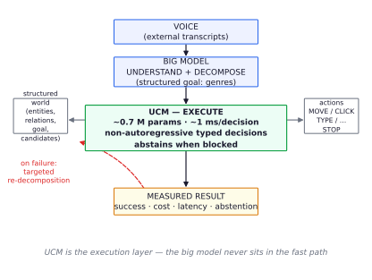
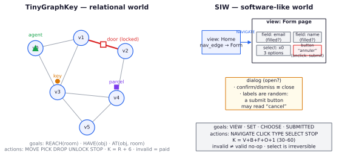
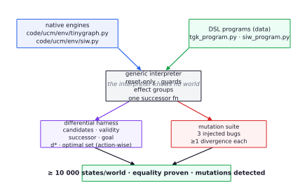
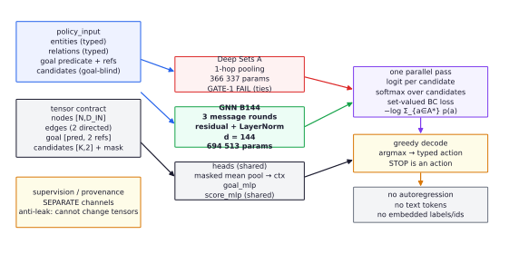
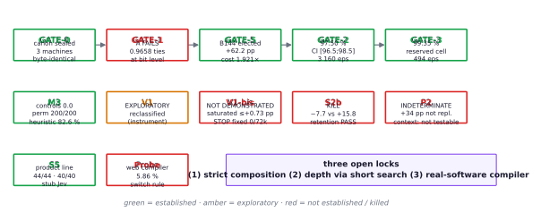
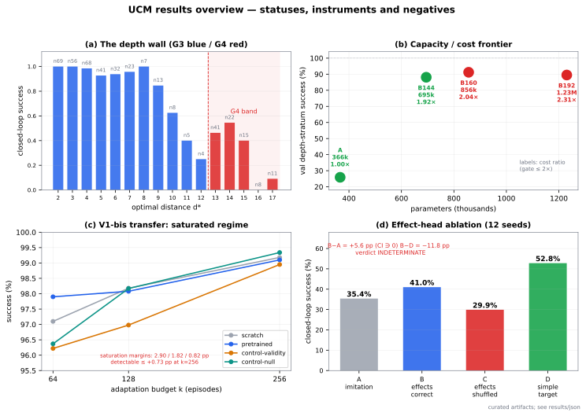
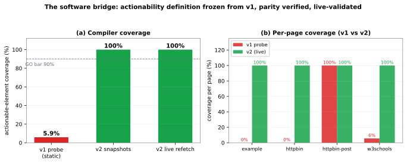
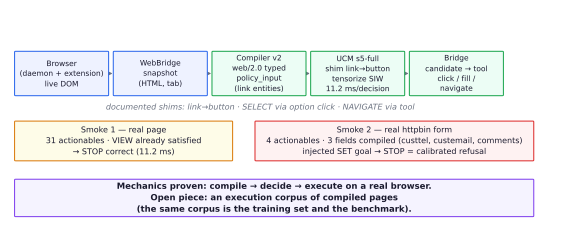

# A Compact Relational Controller for Structured Execution: UCM, from TinyGraphKey to Software Interaction

**Technical report — version 1.1 · 2026-09-25 (second refresh, evening)**

**Author:** cgarrot · **Status:** pre-publication, private repository · **Snapshot:** commit `635ba3c` of the working repository

> **Epistemic status.** This paper is a *laboratory log with formal claims*, not a polished success story. Every quantitative claim below is tagged **[ESTABLISHED]** (pre-registered, sealed evaluation, independent audit), **[EXPLORATORY]** (measured but not confirmatory), or **[NOT ESTABLISHED]** (failed or inconclusive). Negative results and errata are reported at the same level of detail as positive ones. Section 11 documents the research-integrity machinery that produced this ledger.

---

## Abstract

We study whether a very small non-autoregressive policy operating on structured observations can reliably *execute* multi-step tasks — fast, cheaply, and with an explicit abstention channel — in worlds whose interfaces are fully specified and exactly solvable. We introduce **TinyGraphKey (TGK)**, a deterministic relational world with a lockable door and three goal predicates (`REACH`, `HAVE`, `AT`), and **SIW** (Synthetic Interaction World), a software-like world of views, forms, fields, selects, buttons and dialogs whose labels are deliberately uncorrelated with functional roles. Both worlds are re-expressed as instances of a **generic verified DSL interpreter**, together with an exact oracle and a generator, with step-by-step differential equivalence to the native engines (≥10 000 states per world) and mutation testing of the interpreter.

The elected controller, **GNN-B144**, is a 3-round relational message-passing network with 694 513 parameters, trained by set-valued behavioural cloning over syntactically enumerated candidate actions. On held-out TGK layouts it reaches **97.50 %** closed-loop success (CI₉₅ [96.48 ; 98.50], 3 160 episodes, 5 seeds) and **99.35 %** zero-shot success on a reserved recombinatorial cell (CI [98.60 ; 99.88], 494 episodes), at **~1 ms** p95 per decision on CPU (16–38× margin under a 20 ms envelope). Ablations show the capacity is relational: without candidate structure, goal conditioning, or relations the same policy collapses to 0.0; a 1-hop Deep Sets variant fails at bit-exactly tied logits and is outscored by +62.2 pp on the layout-disjoint depth stratum.

We then report a systematically honest sequence of negative and inconclusive results, each with instruments built to make it interpretable: (i) cross-world weight transfer from TGK to SIW **was not demonstrated** at budgets of 64–256 episodes — the target regime is ~97–99 % saturated, and the maximum detectable effect was bounded at **≤ +0.73 pp**, so the experiment is a non-demonstration, not a refutation; (ii) a recurrent refinement block (T = 32) **failed** to beat the one-pass model on deep plans (−7.7 pp vs a frozen +15.8 pp threshold), with retention tests passing; (iii) short in-context histories were **not identifiable by construction** in the executed design, and what was measured is a robustness effect (context *presence* distracts: −8.3 pp) rather than content reading; (iv) an initial **+34 pp** auxiliary-effect-head result did **not replicate** under a 12-seed controlled ablation (B−A = +5.6 pp, CI ∋ 0), and a pre-registered v02 re-run closed as **non-confirmatory** (same seeds and data as v01; the D−A signal is exploratory and the validity target does not enter the canon). In the other direction, the real-software stack made decisive progress: a web compiler v2 goes from **5.86 %** coverage (v1 probe) to **100 % (504/504)** on four real pages — validated live — and a browser end-to-end assembly proves the compile → decide → execute mechanics, while also exhibiting a **calibrated refusal** on compiled pages the executor was never trained on, which is precisely the next piece to build.

The paper's fourth contribution is methodological: sealed canons, one-read instruments, pre-registered gate thresholds with kill rules, attribution controls that differ only in training *source*, atomic crash-safe publication, and an append-only erratum discipline. A product-line integration (simulated comprehension layer + executor) passes its internal criteria on held-out suites (44/44 and 32/32 execution, 40/40 abstention recall, 0/40 false refusals, 1.15 ms p95, ≥500× cheaper than a declared per-decision stub). We close with the open locks: strict inter-signature composition, depth beyond ~15 actions, and the web executor — the compiler reaches 100 % element coverage on the four-page probe, and the remaining gap is an execution corpus of compiled pages.

**Keywords:** compact controllers · relational policies · behavioural cloning · pre-registration · interactive environments · software agents

---

## 1. Introduction

Large generative models *understand* requests but are expensive and slow when used as the decision-maker for every step of a multi-step software task. The premise of this work is **decomposition of labour**: a large model understands, decomposes, and unblocks; a *small*, non-autoregressive controller executes the steps locally, at around one millisecond and a fraction of the cost per decision, and knows when to hand control back. We call the target artifact UCM — *Universal Control Model* — where "universal" is an ambition, not a result.

This report covers the first four days of an intensive, pre-registered research program (435 commits, 2026-09-22 → 2026-09-25). The program asked a narrow question first: *can an explicit interface make a ~0.7 M-parameter policy learn reliable closed-loop control on new instances?* — and then widened in three directions: transfer to a second world (software-like), depth (iteration at decision time), and multi-world structure (context and auxiliary signals). It closes with the first working version of the software bridge: a compiler and a browser end-to-end assembly.

### 1.1 Contributions

1. **Two exact worlds behind one interface.** TinyGraphKey (relational, lockable door, three predicates) and SIW (software-like widgets, four predicates, valid no-ops vs invalid actions) are specified normatively, generated procedurally, and solved by exact multi-source backward BFS oracles (§4).
2. **A verified DSL layer.** Both native engines are re-expressed as data programs interpreted by a generic, reset-only interpreter; differential tests prove state-by-state equality of candidates, validity, transitions and goals, and mutation tests prove the differential *detects* injected bugs (§5). This layer later serves as the generator for held-back task families.
3. **A compact relational controller.** The elected GNN-B144 (694 513 parameters) is trained by set-valued BC and elected on a frozen capacity/cost gate: +62.2 pp over a 1-hop model on the layout-disjoint depth stratum, no loss on the safety stratum, sustained cost 1.921× the 1-hop model under the official interleaved protocol (§6, §7, §8.1–8.2).
4. **A pre-registered evidence ledger with honest negatives.** Transfer to SIW was not demonstrated in a provably saturated regime (bounded ≤ +0.73 pp); recurrence was killed (−7.7 pp vs +15.8 pp); in-context history was shown non-identifiable as designed; a promising +34 pp auxiliary result did not replicate, and the v02 re-run closed **non-confirmatory** (exploratory D−A only; validity target not admitted to the canon). Each negative comes with its instrument limitations quantified (§8.4–8.7).
5. **A working software bridge, measured.** A compiler v2 turns real HTML into strictly typed `policy_input` (closed web vocabulary, LINK action, deterministic DOM-id de-duplication, href resolution) and reaches **100 % element coverage (504/504, live refetch)** on the four-page probe, versus 5.86 % for v1. A browser end-to-end assembly (Live DOM → compiler → executor → native click/fill/navigate tools) proves the mechanics and isolates the remaining gap as an execution corpus of compiled pages (§8.9).
6. **A methodological contribution: the instrument is the result.** Sealed canons, single-read evaluation, shared-initialization controls, robustness counters, atomic publication, append-only errata. We argue these are what make a four-day program of this scope auditable at all (§7, §11).

### 1.2 What this paper does *not* claim

UCM is **not** a competitor to generalist models, **not** a claim about general intelligence, and **not** a deployment-ready system. The worlds are simplified (symbolic observations, closed vocabularies, deterministic dynamics). TGK generalization is established; strict compositional transfer across held-back signatures is **not**; depth beyond ~15 actions is **not**; the web compiler is established on a four-page probe but the **web executor is not** (the smoke test refuses compiled pages it was not trained on). The product demo uses a simulated comprehension layer with measured stub latency, and we say so wherever its numbers appear.

---

## 2. Positioning and related work

**Compact non-autoregressive decision models became a category in 2026.** TypeSafe's *System One Models* (Sept. 2026) formalize typed probabilistic decisions without text generation, and `cua-s1-forms` (706 048 parameters) scores form-field options one-pass with a byte-level Transformer trained entirely on synthetic episodes, with disjoint field-signature splits and a shuffled-context control. UCM shares the thesis (small, typed, one-pass, ~0.7 M parameters) but differs in kind: relational graph observations, goal-conditioned multi-step control with an exact oracle, and transfer between worlds. The convergence on practices — signature-disjoint splits, shuffled controls — is independent validation of the evaluation discipline.

**Relational policies for planning.** Distilling Q* from an exact planner into a relational GNN is published (DFKI/Sarre 2026), including the documented trap that vanilla Q*-regression does not separate optimal from non-optimal actions without a margin regularizer; their Q policy is one forward pass and 3–18× cheaper than V+successors. Self-improving search↔learning loops with relational heuristics reach size generalization in planning (RWTH/Geffner 2026). UCM's one-pass candidate scorer is closest to the former, but trained with a set-valued log-likelihood over candidates rather than Q-regression, and evaluated on procedurally generated world *families* rather than fixed PDDL domains.

**Meta-learning in randomized worlds.** AnyMDP (NeurIPS 2025) meta-trains in-context RL in randomized MDPs; RACES (2026) composes verifiable environments by typed signatures for LLM reasoning. UCM's P2 phase attempted a typed-genre analogue for control but — importantly — its in-context arm turned out **non-identifiable by construction**, a design failure we document rather than paper over (§8.7).

**Evaluation integrity.** 2026 has an active literature on agent-benchmark validity (construct-validity audits, automated benchmark auditing, preregistration for AI-agent experiments, infinite agentic loops as a first-class failure). UCM's machinery — frozen protocols before sealed reads, raw-per-episode publication before aggregation, negative-result retention — belongs to this conversation.

---

## 3. Claim levels and falsification protocol

Following the project spec, conclusions are graded:

- **R0** — pipeline correct, no generalization result.
- **R1** — generalization to new instances of one family.
- **R2** — transfer to explicitly tested dynamics/families.
- **R3** — external replication or independently built families.

The V0 result is **R1** with a controlled composition cell; TGK→SIW transfer is **R2-attempted, not demonstrated**; the recurrent and context results are falsification outcomes, not claim levels. Every threshold was frozen **before** the corresponding measurement, and any threshold movement is an erratum (§11). The operative rule, learned the hard way in this program: **a frozen decision only exists if it is mechanically checkable** — "4/4 gates passed" turned out to be an artifact of in-sample selection, one seed and an asymmetric cost protocol, and the ambiguity was resolved toward the *harder* bar.

---

## 4. Environments

### 4.1 TinyGraphKey (TGK)

A layout is a connected undirected room graph (4–8 rooms at train; up to 64 supported), exactly one door edge with `locked ∈ {true,false}`, one agent, and two transportable objects (a key and a parcel) with a static key→door relation. The observation contains the full topology, positions, possession, door endpoints and state, and the key-door relation. Goals are `REACH(room)`, `HAVE(object)`, `AT(object, room)`. Actions are `MOVE(r)`, `PICK(o)`, `DROP(o)`, `UNLOCK(d)`, `STOP`; **every decision costs one step, including invalid actions, which are paid no-ops**; horizon 64; success requires STOP with the native predicate true, verified by an independent evaluator. The candidate list is syntactic and goal-blind: `K = R + 6`.

The exact oracle enumerates all physical states (`2·(R²+2R)`) and runs multi-source backward BFS from all goal states, yielding `d*` (physical distance), `L* = d* + 1`, and the optimal-action set. The oracle is used for supervision and evaluation only; never as policy input.

### 4.2 SIW — Synthetic Interaction World

SIW mirrors software structure without text, pixels, or real content: 2–5 navigable views; widgets `button | field | select | option | form | dialog`; forms with 2–4 fields and at most one select, exactly one submit button; selects with 2–4 options; labels drawn from a closed ~60-word vocabulary with alias pairs and **randomly assigned independently of role** (a submit button may be labelled "cancel"). Isomorphism is defined on widgets and the FSM — never on labels. Goals are `VIEW(view)`, `SET(field)`, `CHOOSE(option)`, `SUBMITTED(form)`. Actions are `NAVIGATE`, `CLICK`, `TYPE`, `SELECT`, `STOP`; `K = V + B + F + O + 1` (target 30–60 via distractors); horizon 64.

A deliberate semantic feature: SIW distinguishes **paying invalid actions** (navigate non-adjacent, click invisible, type a filled field) from **costly valid no-ops** (click a decorative button; submit an incomplete form; confirm without a dialog). Both are trained and reported separately. `TYPE` is unary and goal-blind — discovered by smoke test to be necessary for `SUBMITTED` solvability: *any goal-conditioned validity rule must be checked against the solvability of all predicates before freezing*. The exact oracle enumerates the full FSM (`views × filled ⊆ fields × chosen × dialog × submitted ⊆ forms`), with valid no-ops as self-loops that are never optimal, and a differential test against the environment.

### 4.3 Why two worlds

TGK tests relational control under resource constraints (key, door, carrying). SIW tests the same *interface contract* against software-like structure: many candidates, arguments, validation order, navigation, arbitrary labels, and two distinct non-productive action classes. If one small policy core handles both, the interface — not the domain — is doing the work. The interface contract (`observe / candidates / execute / goal_satisfied`, with `policy_input` separated from `supervision` and `provenance`) is frozen: no forbidden fields (`d*`, reward, plan, next observation, timestep) may enter the policy input.

---

## 5. The verified DSL layer

Both worlds are re-expressed as **data programs** interpreted by a generic interpreter (`ucm/dsl/core.py`): JSON expression trees with no `eval`, immutable canonical state, and **reset-only construction** (no state injection). The interpreter supports guards, conditional effects, effect groups (false `when` ⇒ valid no-op), set/dict fields, and a successor function shared by BFS and execution. It knows no world; TGK and SIW become two program instances with the same semantics.

Correctness is established by two independent instruments:

1. **Differential equivalence.** For every state reachable from reset (≥10 000 states per world), compare DSL vs native: candidate list, per-candidate validity, canonical successor, and goal truth; then compare `d*` and the optimal-action sets per task (compared as actions, not indices). Result: equality on all covered states.
2. **Mutation testing.** Inject three semantic bugs into the interpreter (`not` ignored; set-add no-op; equality inverted). Each mutation must produce at least one divergence; all three are detected (one requires SIW because set-add does not occur in TGK).

A third invariant, learned from a regression, is centralized: the terminal record `{STOP}` at `d* = 0` is emitted by a shared walker and guarded by a fail-closed assertion that raises (not an `assert` statement, which `-O` strips). The DSL then becomes the *generator* for held-back task families and the source of auxiliary effect labels in P2.

---

## 6. Model family

### 6.1 Tensor contract

Entities become typed one-hot nodes; relations become typed, sense-tagged edges localized to node indices; the goal is a predicate one-hot plus two entity-reference slots (object, room); candidates are `(type, arg1, arg2)` index tuples, padded with a mask. Capacities: `N_CAP = 64`, `K_CAP = 32` (96 in SIW), `MIN_S2CAP = 4` incident slots. Raw ids and labels are never embedded; entity/relation/candidate order is randomized coherently at train and test, and supervision/provenance cannot alter tensors (anti-leak tests). STOP is a first-class action with null arguments.

### 6.2 Model A — Deep Sets (1-hop), 366 337 parameters

Node encoder + one-hop incident-relation pooling, local update, masked global mean context, goal vector, and a shared candidate scorer producing one logit per candidate. This is the deliberately weak baseline. Its failure is informative: on a symmetric pair with identical *signatures*, it produces **bit-exactly equal logits (0.410357 == 0.410357)** — a 1-hop encoder cannot separate what it cannot distinguish in one step. GATE-1 overfit stalled at 96.58 % against a 99 % bar.

### 6.3 Model B — relational GNN, and the width election

Model B replaces one-hop pooling with **three message-passing rounds** (distinct edge-type/sense embeddings, residual + LayerNorm per round; hidden width `d`). The elected configuration is `d = 144` (**B144, 694 513 parameters**). Widths 160 and 192 form the capacity/cost frontier: they improve the depth stratum marginally (91.2 %, 89.5 %) but fail the cost gate (2.035×, >2.31×). The election used four pre-registered criteria on a frozen diagnostic (performance on `d* ≥ 3 ∪ ties`, safety on `d* ≤ 2`, sustained cost ≤ 2×, tie separability), decided **before** the official runs, then promoted on a layout-disjoint validation stratum: **+62.2 pp** (88.1 % vs 25.9 %, CI [54.6 ; 68.9]) with the safe stratum improving from 84.1 % to 100 %.

### 6.4 Training objective

Set-valued behavioural cloning over the candidate set:

$$\mathcal{L} = -\log \sum_{a \in A^*} \mathrm{softmax}_a(\text{logits})$$

Only padding is masked out of the denominator; physically invalid candidates remain in the softmax; STOP is trained like any action. Optimizer everywhere: AdamW, lr 3e-4, weight decay 1e-4, grad-clip 1.0, FP32, batch 64 (32 in P2 cells); checkpoint = best validation, or *final at fixed budget* for adaptation runs (no target selection).

### 6.5 SIW adaptation, and the recurrent CIV block

The SIW model re-shapes only vocabulary-dependent modules (node encoder, goal head, edge embeddings — **698 401 parameters**) while the action scorer transfers with the action count. A recurrent variant (CIV) wraps the base with **one shared message block + GRUCell iterated T = 32 times** (272 448 extra parameters, constant in T; effective iteration count mechanically instrumented), with the base frozen and its SHA verified before/after. This tests "compute, not size" against the one-pass model at equal data budget.

### 6.6 P2: structured context and an auxiliary effect head

The P2 model extends the node vocabulary with context entities (observed action→effect pairs linked to canonical targets) and adds an **auxiliary effect-prediction head** (7 classes: none, moved, carried/dropped object, door unlocked) trained jointly with λ = 0.5. The head never touches the policy logits by construction, which is what makes the ablation clean: policy logits are identical with or without it. The head was later promoted — and then demoted — by the evidence in §8.7.

---

## 7. Experimental methodology

### 7.1 Gates with pre-registered kill rules

The V0 program ran a chain of gates, each with thresholds frozen before measurement and each able to stop the iteration:

| Gate | Question | Frozen threshold |
|---|---|---|
| GATE-0 | data canon correct, sealed, reproducible | byte-identical across machines |
| GATE-1 | capacity to fit (in-sample) | non-trivial optimal-action rate ≥ 0.99 |
| GATE-5 | architecture election on a diagnostic | +5 pts on depth stratum, ≤ 2 pts loss on safe stratum, cost ≤ 2×, tie separability |
| GATE-2 | closed-loop generalization on new instances | success ≥ 95 %, CI-low ≥ 90 %, per-goal ≥ 85 % |
| GATE-3 | zero-shot composition on a reserved cell | success ≥ 80 % |
| M3 | interface controls and failure taxonomy | controls must collapse; taxonomy pre-specified |
| GATE-4 | baselines off-distribution | comparisons reported, no selection |

### 7.2 Sealing and one-read

Dataset generation produces a canonical split manifest; evaluation canons are read through a **sealed one-read registry** (single `open`, realpath-keyed, intent logged *before* the open), and freeze manifests bind the code files, input SHAs, budget plan and seeds — code drift aborts before any read. Adaptation budgets are **episode-level** (k complete episodes with their terminal STOP, prefix-nested and hash-published), and the confirmatory run used a freeze built specifically for it (v10), executed once by four workers (120 cells = 4 arms × 10 seeds × 3 budgets), with all raw per-episode rows persisted **before** aggregation.

### 7.3 Attribution controls

Transfer runs compare four arms that differ **only in the source of supervision**: (i) `scratch` (random init), (ii) `pretrained-TGK` (canonical B144 loaded), (iii) `control-validity` (supervision replaced by a uniform draw among physically valid actions — removes decisional information but keeps validity structure), (iv) `control-null` (uniform over all candidates — validity-blind). All arms share the same nested data slice, the same seed-matched fresh initialization before weight loading, identical optimizer/updates/batch/checkpoint policy, and no selection on target performance. Interpretation contract, fixed in advance: if the validity control matches pretrained, the gain is optimization/exposure; if it matches scratch, the gain is decisional information; overlapping CIs mean **attribution is not established**.

### 7.4 Statistics

Primary statistics are paired and hierarchical where the design demands it (seeds as blocks; layout/task clusters where applicable); bootstrap CIs are 95 %; confirmatory thresholds are one-sided. When a protocol's variance assumption was found unverifiable (a 10.9 pp SD that could not be derived from published differences), the project **revoked it and re-derived** the power analysis from the visible n−1 estimate (12.61 pp), accepting the lower nominal power (≈75 % at 10 seeds for 10 pp) rather than keeping a convenient number.

### 7.5 Artifact discipline

Every run writes an immutable artifact (config, metrics, final state, checkpoint) with failure to overwrite; final publications use crash-safe atomic bundles and hardlink pointers; interaction logs are SHA-256-chained; journals are append-only with refusal of invalid tails. Results of record are recomputed from raw rows by a second party (auditor) before being cited. This machinery caught real problems (see §11).

## 8. Results

### 8.1 V0 — TGK generalization and composition **[ESTABLISHED]**

**GATE-2 (generalization).** B144, 5 seeds, one sealed read per seed, arms frozen from validation: **success 97.50 %** on 3 160 held-out episodes (630 layout clusters), CI₉₅ **[96.48 ; 98.50]**, vs the frozen ≥95 % / CI-low ≥90 % bar. Per goal: REACH **98.76 %** (n = 1 050), HAVE **99.72 %** (n = 1 060), AT **94.00 %** (n = 1 050) — the only sub-95 % predicate. Mean regret on successes 0.056, invalid actions 9.96 % of steps (they are paid but not fatal), premature STOP 0.03 %. Checkpoint selection used validation only; test was read once.

**GATE-3 (composition, zero-shot strict).** A reserved cell — `AT(key, junction)` — significant never appears in training or validation. The GATE-2 checkpoints, unchanged and arms frozen, reach **99.35 %** over 494 episodes × 5 seed-reads = 2 470 episodes on 102 layouts, CI **[98.60 ; 99.88]**, vs the frozen ≥80 % bar; invalid rate 0.46 %, regret 0.023. Success is 100 % up to `d* = 6`, 99.6 % at 7, 91.9 % at 8, 96.9 % at 9, 90 % at 10. Two episodes were skipped by documented duplicate-merge dedup (disclosed in the artifact), and a premature pilot read of the extension cell was disclosed as an incident rather than hidden.

### 8.2 Controls, baselines, failure mechanics, and the depth wall **[ESTABLISHED / descriptive]**

**Interface controls (M3).** Remove the goal (tags and binding): success **0.0** (with 28 % "goal reached without STOP" — the policy moves plausibly but cannot terminate). Candidates zeroed: **0.0** (it always STOPs). Relations removed: **0.0**. Counterfactual goal swap: **0.960**. Coherent permutation of entities/relations/candidates: outcomes identical in **200/200** episode-permutations. The capacity lives in the goal-conditioned relational interface, not in incidental structure.

**Off-distribution baselines (GATE-4).** On `test_g1`, model **97.5 %** vs a goal-blind local heuristic (R1–R6: STOP if satisfied, pick goal object, drop at goal room, unlock when possible, random valid move) **82.6 %**, random-valid **60.6 %**, random-syntactic **4.6 %** — a +14.9 pp margin over the heuristic, with the heuristic never performing an invalid action.

**Failure taxonomy (pre-specified before inspection).** Of 3 160 episodes, 83 failed (the official count is 79 after a stochastic-replay reconciliation; see Appendix B). Categorization: **46 absorbing loops (55 %)**, **36 repeated invalid actions (43 %)**, 1 other; zero forgotten-STOP, wrong-target, or binding failures. All AT failures occur at `d* ≥ 6`, with mean length 63 (timeouts) against `L* = 9.9`: the model is not confused about *what* to do — it loses the thread of a long route.

**The depth wall.** Per-depth success on G3 (326 episodes, overall 94.5 %) and G4 (103 episodes, overall **36.9 %**):

| d* | 2 | 3 | 4 | 5 | 6 | 7 | 8 | 9 | 10 | 11 | 12 | 13 | 14 | 15 | 16 | 17 | ≥18 |
|---|---|---|---|---|---|---|---|---|---|---|---|---|---|---|---|---|---|
| success | 100 | 100 | 98.5 | 92.7 | 93.8 | 95.7 | 100 | 84.6 | 62.5 | 40.0 | 25.0 | 46.3 | 54.5 | 40.0 | 0 | 9.1 | 0 |
| n | 69 | 56 | 68 | 41 | 32 | 23 | 7 | 13 | 8 | 5 | 4 | 41 | 22 | 15 | 8 | 11 | 6 |

Success is essentially perfect at shallow depth and collapses beyond ~12–15 actions, consistent with a fixed 3-round receptive field plus greedy decoding. This is a **mechanistic** limit: the model lacks the effective lookahead, and neither width (B160/B192) nor more data fixed it (see S2b, §8.6).

### 8.3 Cost and latency **[ESTABLISHED]**

Runtime budget: ≈4 h 50 of a 24 h accelerator envelope; official train + evaluation 86.3 min; peak RSS 749 MB (training), 67.6 MB (batch-1 inference). Batch-1 latency p95 is **0.52–0.66 ms** on quiet CPU cells; under the *official interleaved-sustained* protocol (both arms `mx.compile`d, alternating blocks, median of blocks 2–6) B144 costs **1.921×** the 1-hop model (IQR 0.309, corroborated 1.913) — inside the pre-registered ≤2× gate. B160 costs **2.035×** (IQR 0.017, 5/5 blocks >2.00) and fails; B192 exceeds 2× on three independent measurements (3.05 / 2.31 / ~2.15). The pre-committed stopping rule was honoured: the iteration ended with a published frontier (A / B144 / B160 / B192) rather than a third width. *Process erratum:* two incompatible cost statistics had been frozen (#11 best-device, #12 interleaved); they were reconciled before the official run by declaring the interleaved-sustained protocol official because the spec demands the sustained regime, with quiet-cell numbers kept as diagnostics.

### 8.4 V1 — exploratory transfer to SIW **[EXPLORATORY]**

The first transfer campaign (3 arms × 5 seeds × k ∈ {0,100,500,2000,10000} unique state-goal couples, 600 sealed test episodes, 2 000 updates) reported at the primary point k* = 500: pretrained − scratch = **+12.57 pp**, paired CI [2.56 ; 22.35], and control − scratch = **+13.37 pp** [3.77 ; 22.76], while control − pretrained = **+0.81 pp** [−13.32 ; 13.88] — i.e. the validity-informed control matched pretraining, and **no decisional attribution was established**. Area under the learning curve (log k): scratch 0.199 / pretrained 0.253 / control 0.287. Three instrument violations were disclosed after the fact (the "one read" invariant was not held — 11 opens; a provenance hash was duplicated across budgets; raw per-episode rows and checkpoints were not persisted), and the cell was **reclassified EXPLORATORY**. It motivated the V1-bis redesign: episode-level trajectories with terminal STOP, four arms, ten seeds, freeze manifests, and single-read Stage-B evaluation.

### 8.5 V1-bis — confirmatory transfer, and the value of a saturated regime **[NOT ESTABLISHED, bounded]**

The confirmatory design froze: 4 arms (scratch / pretrained-TGK / control-validity / control-null), 10 seeds, episode budgets k = 64 / 128 / 256, 6 000 sealed test episodes per cell, identical optimizer and checkpoint policy, shared seed-matched initialization, and one read of the sealed test — 120 cells, 72 000 raw per-episode rows persisted before aggregation, executed once in 3 h 37.

| Arm (mean success by k) | 64 | 128 | 256 |
|---|---|---|---|
| scratch | 97.10 % | 98.18 % | 99.18 % |
| pretrained-TGK | **97.90 %** | 98.08 % | 99.10 % |
| control-validity | 96.22 % | 96.98 % | 98.95 % |
| control-null | 96.37 % | 98.17 % | 99.34 % |

| k | pretrained − scratch | CI₉₅ | verdict |
|---|---|---|---|
| 64 | +0.80 pp | [0.25 ; 1.97] | FAIL (point < 5 pp) |
| 128 | −0.10 pp | [−1.12 ; 2.40] | FAIL |
| **256 (primary)** | **−0.08 pp** | **[−0.78 ; 2.08]** | **FAIL** |

Two facts make this a **non-demonstration rather than a refutation**. First, the regime is nearly saturated: the largest margin available to *any* arm was 2.90 / 1.82 / 0.82 pp at k = 64 / 128 / 256, so the frozen 5 pp bar was unreachable by construction; the corrected 95th-percentile bound on any possible effect at k = 256 is **≤ +0.73 pp**. Second, the instrument was repaired: **`goal_reached_without_stop = 0 / 72 000`** episodes, against 29–44 % in V1 — the R* repair (physically reachable trajectories with a terminal STOP at `d* = 0`) eliminated the termination pathology, which is the most direct construct-validity demonstration in the project. The k = 64 secondary point is at least suggestive — +0.8 pp with one-sided p ≈ 0.028 (Bonferroni ×3 ≈ 0.085), a **−28 % relative failure rate** (126 vs 174 failures / 6 000), inverting sign at larger budgets. Descriptives for future designs: real difficulty is ~6 % of the test (a tail of 38 episodes; VIEW at `d* ≥ 3`, CHOOSE at `d* ≥ 4`, SET at `d* = 4`, SUBMITTED at `d* = 7`), 90 % of timeouts are absorbing loops, and SIW-small is **solved by the oracle (~100 %)** — so it cannot support transfer claims at any budget without changing the family or the budget regime.

### 8.6 S2b — recurrence on deep plans **[NOT ESTABLISHED / KILL]**

A 2×2 factorial crossed model (one-pass B144 | recurrent CIV T=32) with data source (exact oracle | recovery: deviate one non-optimal action then re-solve, f = 0.3), 5 paired seeds, 2 000 updates, equal data volume, on the deep G4 stratum `d* ∈ [13,15]` (n = 78). Frozen predicate: CIV − B144 ≥ **+15.8 pp** with CI-low > 0.

| Per-seed success (%) | s100 | s101 | s102 | s103 | s104 | mean |
|---|---|---|---|---|---|---|
| B144-oracle | 55.1 | 47.4 | 47.4 | 61.5 | 52.6 | **52.8** |
| CIV(T=32)-oracle | 51.3 | 47.4 | 42.3 | 28.2 | 56.4 | **45.1** |
| difference (pp) | −3.8 | 0.0 | −5.1 | −33.3 | +3.8 | **−7.7** |

**Verdict: KILL.** The recurrent block did not beat the one-pass model at equal data budget. Three audit obligations were published with the result: (1) the test was **conservative** — CIV trained only the refine block over a frozen canonical base while B144 adapted everything, so the KILL applies to "refine without an identity path over a frozen head", not to any light iteration; (2) the shallow retention check was not executed in the run and was later completed as an annex — retention at `d* ≤ 8` is **97.9–99.4 %**, within the ≤2 pp criterion everywhere; (3) deep-band context: B144-oracle 45.2 % and 21.6 % on [13,24] and [16,24], CIV-oracle 38.6 % / 18.4 %, canonical zero-shot 25.2 % / 8.0 %. The data-source effect (oracle > recovery, +6.4 pp mean) did not reach significance (one-sided p = 0.094, n = 5) and was **not** promoted. Prospectively: seed variance was 5.9 pp on this stratum, giving a real MDE of ≈18.5 pp — above the frozen 15.8 pp threshold, i.e. the frozen threshold was *below* the design's actual detectable effect. The verdict is unchanged (FAIL is even clearer), and the lesson entered the rulebook: **measure inter-seed SD at the real base before freezing a threshold; never lower a frozen threshold — increase n before the freeze.**

Runtime profile of the recurrent variant, for the record: p95 14.08 ms per decision (model-only, conservative gate measure; PASS under 20 ms), ~10–12× the per-update wall of the one-pass model, RSS 9.7 GB vs 1.4 GB.

### 8.7 P2 — structured context and the auxiliary effect head **[NOT ESTABLISHED; one real robustness effect]**

P2 asked whether a fresh model can exploit a short structured context (observed action→effect pairs attached as graph entities) on held-back TGK families (`DROP-AT`, `DROP-HAVE`, `d* ∈ [2,12]`), with an auxiliary effect-prediction head trained jointly. Arms: D0 (no context), D1-mixed (30 % of episodes with correct context), D1-shuffled (same volume, permuted targets). An equal-information oracle gate had to clear ≥30 % before any training.

**The in-context question was not identifiable by construction.** TGK semantics are constant across episodes, the constructed context linked canonical targets, and the history came from *another* episode's optimal plan: the context carried no inferable information about the current task. The pre-registered oracle gate passed vacuously (it measured "solvable without the observed UNLOCK"). What the run *did* measure is worth keeping: on DROP-HAVE, D1-mixed ≤ D0 in 8/8 seeds (**−18.8 pp**, p = 0.031 pre-specified; post-hoc one/two-sided p = 0.055/0.11, Holm-killed — so the effect is real in sign and fragile in inference), i.e. **the model is distracted by the presence of irrelevant context edges**. DROP-AT showed 0.0 pp, but the family's effective ceiling was 91.7 % (one episode fails for all 24 runs) against a 10.2 pp Δ_min — the window was unreachable, another dimensioning failure. A discriminant addendum (no training) showed D1-mixed weights scoring **55.2 % without context vs 46.9 % with it** (5/8 paired seeds), while shuffled weights ignore context in both conditions (27–28 %): reliable evidence for **presence sensitivity**, zero evidence for **content reading**. The earlier "the model reads the context" formulation was withdrawn by erratum.

**The +34 pp effect-head story did not replicate.** A suggestive initial contrast (native 0.3125 vs run4-without-context D0 0.65625) motivated a controlled 12-seed × 4-arm ablation at 2 000 updates: A = imitation only, B = correct effect labels, C = shuffled effect labels, D = **simple** validity/termination labels, all with the same auxiliary-head machinery and a provably untouched policy path.

| Arm | Closed-loop success | Auxiliary convergence |
|---|---|---|
| A (imitation, no head) | 35.4 % | — |
| B (effect head, correct) | 41.0 % | effect loss → 0.096 |
| C (effect head, shuffled) | 29.9 % | effect loss → 0.129 |
| **D (simple target)** | **52.8 %** | 0.096 |

B − A = **+5.6 pp, CI ∋ 0**; B − C = +11.1 pp (content matters for *learning the head*); B − D = **−11.8 pp** (the simple target is *better*). The policy path is untouched by construction (identical logits), so the head is purely auxiliary. **Verdict: INDETERMINATE** — level 1 failed (CI covers 0) and level 2 failed (B < D). The executed design also deviated from the frozen design (n_test = 12 per family instead of 800, 2 000 updates instead of 4 000), leaving per-seed rates spread 0.25–0.92; with the executed power, no honest conclusion is possible. The honest summary is: *an auxiliary signal of some kind may help (A → D = +17.4 pp for the simple target, not established statistically); specific effect targets add nothing over a simple validity/termination target at this budget; the initial +34 pp is not replicated.*

**The pre-registered v02 re-run closed as non-confirmatory.** v02 (72 cells: 2 families × 3 arms — A/B/D, arm C removed — × 12 seeds, 4 000 updates) re-executed the *same seeds and data* as v01, on which the D−A hypothesis was born; it is therefore not a confirmatory test. Per-arm means over the two families: A 62.2 %, B 66.3 %, D 71.5 % (D−A = **+9.4 pp**). Under the frozen V1-bis convention (bootstrap seed-cluster, signed sum), the D−A interval excludes 0 and the point clears 5 pp; under a paired t-test or a z convention the interval *includes* 0 — the sensitivity table is published with the verdict, exactly because the convention had to be named. The frozen permutation test gives p = 0.047 one-sided, **carried by the saturated DROP-AT family**; DROP-HAVE alone p = 0.0625. D−B (+5.2 pp) is not significant after Holm. The final closing statement, adopted verbatim: *"v02 re-executes v01's seeds and data: non-confirmatory. D−A remains exploratory (+9.4 pp, one-sided p = 0.047, carried by a saturated family). Validity does not enter the canon."* The product does not depend on it. Two method rules entered the rulebook: every ablation must **name its CI/p convention**, and a re-run on the same data is never confirmatory.

**Depth/signature probes (eval-only).** H1 (depth vs signature): stratum B — AT with `d* ≤ 12` requiring the door — 80 % (20/25), so low-depth door traversal is solved; stratum A — AT at `d* ∈ [20,24]` *without* a door — sampled **zero** tasks: on the training layouts, extreme depth essentially always requires the door. The pre-registered discriminator was therefore **structurally incomplete** (rarity, not difficulty). H2 (goal→action-type shortcut): initial argmax == DROP in 8.33 % of fresh DROP-HAVE tasks, far below the 40 % threshold — the shortcut **does not exist as pre-registered**; yet zero-shot closed-loop success is **58.3 %** (7/12), meaning the model solves a held-back family without fine-tuning via a plan that does not begin with DROP. That is genuine zero-shot planning, and it reframes strict composition as the next lock rather than a total absence of capability.

### 8.8 S5 — product-line integration **[internal criteria met in a synthetic demo]**

The deployment-shaped test wires: (simulated) comprehension → structured requests → UCM executor, with an exact planner as the upper baseline and a declared per-decision cost model for the big-model alternative (JEV_MS = 1 200 ms/decision, an explicit stub). Final table on the held-out S5 distribution (fresh layouts *with dialogs*, 512 adaptation episodes, calibration v2, 6 000 updates):

| Metric | Result | Frozen bar |
|---|---|---|
| Execution success | **44/44 = 100 %** | ≥ 97 % |
| p95 per decision | **1.146 ms** | ≤ 5 ms |
| Cost ratio vs stub | **1 120×** (formula: 1 200 ms × 147 decisions / 157.5 ms measured UCM, same checkpoint) | ≥ 10× |
| Abstention recall (impossible goals) | **40/40 = 100 %** | ≥ 90 % |
| False refusals (feasible controls) | **0/40 = 0 %** | ≤ 5 % |

The abstention behaviour is learned, not positional: v2 calibration used 1:1 discriminant pairs on the *same layout* (a refused impossible task and a feasible one), half the refusals supervised from intermediate states, and the frozen-before-training result is perfect recall with zero false refusals on disjoint splits ("reachability is the signal, not the position"). The engineering history is instructive: after impossible goals were first generated by DSL constraints (closed dialog + target widget inside it, oracle-verified unreachable), abstention recall was **0/24**; a first remediation reached 40/40 recall but **27/40 false escalations**; the pre-registered v2 calibration then achieved 40/40 ∧ 0/40. The full-budget run then fixed execution: the lever was the **training distribution** (512 episodes of the deployment distribution), not the budget alone.

The end-to-end demo (32 spoken-style requests in a forms sub-world, simulated comprehension layer with measured 0.026 ms/request stub latency, external voice layer *not exercised*) scores 32/32 with a 505.9×–581× ratio depending on the run. We restate the required formulation verbatim: **"UCM satisfies our four internal criteria in a synthetic demonstration with simulated Jev; end-to-end validation with real voice and real Jev, and real economic benefit, remain to be established."**

### 8.9 The software bridge: compiler v2 and browser end-to-end **[compiler ESTABLISHED on the probe; executor NOT ESTABLISHED]**

**The v1 probe (the baseline).** Four real public pages were fetched statically and compiled DOM→`policy_input` by the first probe. **Completeness: 5.86 % (30/512 actionable elements)**. Real *forms* were already covered at 100 % of their own elements (fields and submit → TYPE/CLICK: 2/2 on the httpbin form); the denominator was dominated by hyperlinks (476/512 on a tutorial page) for which UCM v1 had no LINK action. Three concrete blockers were recorded: the closed P2 vocabulary (`view` outside the TGK vocabulary), collate width (D_IN 21 vs 7), and duplicate DOM ids (`fname` twice). The pre-registered ≥90 % bar failed and triggered the project's switch rule (in-context re-opened as a candidate).

**Compiler v2.** The three blockers were treated with the v1 actionability definition **frozen verbatim**, so that parity is mechanically verifiable: v2 introduces a **closed web vocabulary** (`view, form, field, button, select, option, link`; actions `TYPE, CLICK, SELECT, NAVIGATE, STOP`) with strict per-action argument typing and systematic validation; deterministic DOM-id de-duplication (first occurrence keeps the bare id, later ones get `_2`, `_3`, with renames traced in stats); and hyperlinks as first-class `link` entities with `href_raw / href_resolved / href_kind` (relative, site-root-relative, absolute, scheme-relative, anchor, same-page, other-scheme, unresolvable) and `NAVIGATE` candidates. Replaying the v1 module on the snapshots reproduces the exact v1 counters (512 actionable / 30 covered / 5.86 %). On those snapshots v2 scores **100 % everywhere**: httpbin-post 4/4, example 1/1, httpbin 5/5, w3schools-forms 494/494 — **504/504, GO ≥ 95 % PASS**. A **live validation** then refetched the four pages from the network, compiled the *real* DOM, persisted the HTML as evidence, and reproduced **100 % everywhere (504/504 live)** — the compiler is validated for the product on these four pages. Twenty-one dedicated tests cover id collisions, href resolution kinds, form nesting, v1 parity, vocabulary rejection, hermetic report regeneration and reproducibility of committed artifacts. Declared non-coverage (out of v2 scope): JavaScript-injected content and SPAs, iframes/shadow DOM, disabled/hidden state, event handlers, ARIA, and tensorization (the consumer's responsibility).

**Browser end-to-end assembly.** The chain was wired for real: a browser daemon + extension (22 capabilities, connected) provides live DOM snapshots; compiler v2 compiles them; a documented shim maps `link → button` for the closed SIW vocabulary; the s5-full executor decides (measured 11.2 ms); a candidate→tool bridge executes native click/fill/navigate. Two smoke tests were persisted as first-class artifacts: (1) a complete chain on a real page (31 actionables, correct STOP because the injected VIEW goal was already satisfied); (2) a real httpbin form (4 actionables, 3 fields compiled — `custtel`, `custemail`, `comments` — with an injected SET goal). The second smoke produced the key product finding: **the executor STOPs on the web form — a calibrated refusal** — because its training world (SIW layouts) is not the world of compiled web pages. The mechanics *compile → decide → execute* are proven; the web **decision** requires an executor trained on a corpus of compiled pages — and that corpus is exactly the training data planned for the next piece. A daemon quirk (a `navigate` call returning HTTP 500 while navigating) is documented as an audit note for the daemon side.

**Status.** Compiler: established on the four-page probe (v1 parity, snapshots 100 %, live 100 %, 21 tests). Web executor: not established (refusal is expected and explained; no web-execution benchmark exists yet). The strict-composition and depth locks are unaffected by this section.

---

## 9. Discussion

### 9.1 What the evidence supports

Within its declared perimeter, the program establishes that a **~0.7 M-parameter relational policy with an explicit interface** can execute structured tasks in new instances of a relational world at near-perfect rates, recombine reserved compositions zero-shot, run in ~1 ms per decision, and expose a learned, calibrated abstention channel. It also establishes, at the same evidential level, that the *interface* is load-bearing: destroying candidate structure, goal conditioning, or relations collapses the policy to zero, and a one-hop encoder fails at bit-exactly tied logits where the relational model separates.

### 9.2 Failure mechanics worth naming

1. **Absorbing loops are the dominant failure mode** (55 % of V0 failures; ~90 % of saturated-SIW timeouts) — agents that oscillate between two states forever. Frontier 2026 work recognizes infinite agentic loops as a first-class failure; UCM's data says the same for compact controllers, and it argues for termination-aware training signals.
2. **Depth walls are computational, not parametric.** The wall sits around 12–15 actions for 3 message rounds; more width did not move it; recurrence in its tested form did not either. The project's honest statement is now weaker than its first draft: fine-tuning on shallow deep-family data (d* 2–12) generalizes to d* 13–24 (25 % → 45 %); short *search* at decision time was **not** tested (the "beam" was broken, the greedy arm is the reactive policy — the §13.4 GO was retracted by erratum).
3. **Ceilings are experiments too.** The V1-bis non-demonstration and the DROP-AT unreachable window are both cases where the *headroom* was smaller than the *threshold*. Dimensioning must be enforced against measured pre-registration, not assumed from pilot SDs.
4. **Attribution needs identical everything else.** The validity-informed control matching pretraining in V1 is exactly why V1-bis added a null control and shared initialization — and why its conclusion is "not demonstrated" rather than "transfer works" or "transfer fails".
5. **Presence vs content.** Irrelevant graph structure measurably distracts a trained policy even when it carries no information (−8.3 pp), while content reading remains unproven. Robustness to context noise is a real (if unglamorous) finding.
6. **Synthetic supervision can be construct-invalid.** Propagating a terminal failure label to all prefixes, or supervising only initial states, makes success look broken; the R* repair proving it (0/72 000) is a template for diagnosing such bugs.

### 9.3 The rulebook (method lessons that generalize)

- A frozen decision exists only if it is **mechanically checkable**; ambiguous bars resolve toward the harder one.
- The **verdict harness is code to audit** (a sign inversion produced exactly inverted verdicts, twice).
- Measure inter-seed SD **at the real base** before freezing a threshold; never lower a frozen threshold — add seeds before the freeze.
- A source of gain can be an **artifact of the regime**: verify that the regime has headroom before claiming an effect.
- Every verdict line cites **artifact + world + model + method**; tests added after a freeze never cite the frozen design.
- Logs only count if they count **everything**; "one read" is an instrument invariant, not a slogan.
- Executed dimensioning ≠ frozen dimensioning; deviations are errata, not footnotes.
- **Name the CI/p convention before running an ablation** (bootstrap seed-cluster signed-sum by default), and publish the sensitivity table when conventions disagree.
- **A re-run on the same seeds and data is never confirmatory**, however pre-registered it looks; new data or new seeds are the price of confirmation.
- Freeze the **measurement definition** with the code that consumes it: the web compiler's actionability definition was copied verbatim from v1, which is what made 5.86 % → 100 % a mechanically verifiable statement rather than a rhetorical one.

### 9.4 A note on the web bridge's refusal

The browser end-to-end run produced a result worth naming separately: the executor *refused* a real web form by STOPping, not by failing. This is the abstention channel working as designed under distribution shift — the model is out of its training world and says so. It reframes the web roadmap: the missing piece is not a better refusal, but an **execution corpus of compiled pages** (the planned 300–400-page corpus is both the training set and the benchmark), after which the same refusal calibration must be re-measured on web tasks.

---

## 10. Limitations and threats to validity

1. **Worlds are simplified.** Symbolic observations, closed vocabularies, deterministic dynamics, exact oracles. SIW is software-*like*, not software.
2. **R1, not R3.** TGK generalization is single-world; composition was verified on one reserved cell; no external replication yet.
3. **One random-seed cluster per claim.** 5–12 seeds per cell, and the P2 ablation's executed power was far below design.
4. **Statistically fragile sub-results.** The k = 64 transfer point (p ≈ 0.028 one-sided, ≈0.085 Bonferroni) and the P2 absence effects (post-hoc p = 0.055/0.11, Holm-killed) are suggestive, not established.
5. **The product metrics use a declared stub** (1 200 ms/decision) and a simulated comprehension layer; the ratio is a latency-ratio model, not a measured end-to-end cost.
6. **The web probe is static and tiny** (4 pages, ~504 elements, live-validated); the 100 % and 5.86 % figures are coverage diagnostics under the frozen v1 actionability definition, not a benchmark; JavaScript/SPAs, iframes, disabled-state and event semantics are out of scope, and no web execution benchmark exists yet.
7. **The web executor decision is not established.** The end-to-end smoke proves mechanics and exhibits an expected calibrated refusal; it is not an execution result.
8. **Checkpoint reconciliation.** Canonical V0 checkpoints used in later work were width-filtered at runtime (the s5–s9 artifacts are width 192, not 144, and were never loaded by any run); the incident is closed by shape verification, not re-execution.
9. **Reporting is French-first internally.** The archive (`archive/`) preserves the original documents; this paper is the English synthesis and may smooth translation nuances.

---

## 11. Reproducibility and research integrity

This program treats integrity machinery as a deliverable. Concretely:

**Sealing.** One-read registries; freeze manifests binding code files, input SHAs, budget plans and seeds (v4 → v10 revisions for the confirmatory run); byte-identical canon reproduction on three machines; raw per-episode rows published before aggregation (72 000 rows for V1-bis); independent recomputation by an auditor of record.

**Append-only errata.** Fourteen errata and five incidents are part of the record (Appendix B). Representative examples: a bootstrap definition held anti-conservative and superseded days before the run; a power SD revoked as underivable and re-derived; a failure-count discrepancy traced to a stochastic replay; an over-claim cycle where a "4/4" scoreboard was corrected to 3/4 (the 97 % execution line came from *another world and model*), then re-earned at 4/4 on the correct base; a checkpoint-width reconciliation closing an incident *without* re-execution because no run had ever loaded the artifacts; and the v02 ablation closure where a statistically alive signal was demoted to exploratory because the run re-used v01's data.

**Transparency tables.** The V1-bis campaign published a **joint cell table** (122 rows: 4 arms × 10 adaptation seeds × 3 episode budgets, plus reference rows) exposing the dependency structure that averages hide: ten adaptation runs share only **five** canonical B144 starting points, so cells are not independent — the inference must cluster on sources. The ablation v02 published its 72 cells and raw rows, its frozen convention, and the three-convention sensitivity table alongside the verdict.

**Seven interceptions before contamination** in V0 alone (distribution imbalance, test-split zeros, stale-generator seal, mapping harness, inverted-CI verdict harness ×2, unimplemented frozen decisions), at roughly one hour of total cost — an argument for cheap adversarial checking.

**Publication mechanics.** Crash-safe atomic bundle publication (O_EXCL temp → fsync → hardlink, never overwrite), append-only framed journals that refuse invalid tails rather than truncating, SHA-chained interaction logs that count every interaction or fail, incident reports for read-protocol violations.

**Budget honesty.** V0 consumed ≈4 h 50 of the 24 h envelope; wall-clock and CPU-cumulated figures are reported separately; profile contexts (quiet vs shared machine) are disclosed with the measurements.

---

## 12. Conclusion and roadmap

The first four days produced one solid capability, a working software bridge, and a map of the edges. **Solid:** a 694 513-parameter relational controller, elected by falsification on a capacity/cost frontier, generalizes to unseen relational worlds at 97.5 %, recombines reserved compositions zero-shot at 99.4 %, decides in ~1 ms, collapses to 0.0 when its interface is destroyed, and supports a calibrated abstention channel that passes its product-line bars in a synthetic demo. **Also working:** a web compiler v2 at 100 % element coverage on the four-page probe (v1 parity verified, live-validated) and a browser end-to-end arm that executes native tools — while correctly refusing compiled pages outside its training world. **Edges, now measured:** cross-world weight transfer is bounded by regime saturation (≤ +0.73 pp detectable); recurrence as implemented does not buy depth; in-context history as designed was not a real test; the auxiliary-signal question closed non-confirmatory (exploratory D−A only; validity not in the canon); strict inter-signature composition is at 0 % (one exploratory point); the web executor has no training corpus yet.

Three locks remain, in priority order:

1. **Strict composition.** Build a pre-registered family where held-back signatures are known-optimal and measure whether held-back-signature competence emerges from within-band training. The H1/H2 probes already show the model plans zero-shot on a held-back family (58.3 %) without the goal→type shortcut.
2. **Depth via search, not size.** The reactive policy generalizes from shallow training to deep strata (25 % → 45 %); a correct short-search arm (fixed beam or a verified lookahead) is the untested hypothesis, and the retraction of the original §13.4 claim makes this a clean next experiment.
3. **The web executor and its corpus.** The compiler side is done for static pages (100 %, live-validated); the missing piece is now an **execution corpus of compiled pages** (planned 300–400) that serves as both the training set and the benchmark, plus the consumer's tensorizer (web vocabulary, D_IN) and a LINK action in the policy's action space. The calibrated refusal observed in the smoke tests must be re-measured on web tasks after that training step.

Product-side, the next milestones are: train the executor on the compiled-page corpus, plug the real voice transcripts and the real comprehension model into the S5 harness, and measure the economic comparison rather than modelling it.

---

## Appendix A — Hyperparameters (frozen defaults)

| Setting | Value |
|---|---|
| Optimizer | AdamW, lr 3e-4, weight decay 1e-4, grad-clip 1.0, FP32 |
| Batch | 64 (V0/V1); 32 (P2 cells) |
| V0 training | ≤ 10 epochs / 10 000 updates, validation every 500, best-val |
| Adaptation | 2 000 updates, checkpoint *final at fixed budget* (no target selection) |
| GNN-B144 | d = 144, 3 message rounds, 694 513 params |
| Deep Sets A | d = 128, 366 337 params |
| SIW-adapted B144 | 698 401 params |
| CIV recurrent | T = 32 shared iterations, 272 448 refine params (total 970 849) |
| P2 model + head | ≈738 008 params, λ = 0.5, 7 effect classes |
| Tensor caps | N = 64, K = 32 (96 SIW), incident slots ≥ 4 |
| Budgets | V1 k ∈ {0,100,500,2000,10000}; V1-bis k ∈ {64,128,256} episodes |
| Seeds | V0 5; V1-bis 10; S2b 5 (100–104); P2 8–12; S5 3 |
| Eval RNG | 10 000 / 20 000 / 30 000 / 40 000 + seed, seed-shared across arms |

## Appendix B — Errata and incidents ledger (condensed)

| ID | Type | Correction |
|---|---|---|
| E1–E3 | Protocol V1-bis | Adaptation updates/batch fixed pre-run; bootstrap definition superseded (1-level, seeds as paired blocks); power SD revoked and re-derived (12.61 pp; ≈75 % power at 10 seeds for 10 pp) |
| E4 | GATE-2/M3 counts | 83 vs 79 failures = stochastic replay (different RNG harness); official 79/3160 = 97.50 % |
| E5 | Recurrent profile context | Conservative model-only p95 14.08 ms is the gate measure; full-path 11.79 ms under lighter load; RSS 9.7 GB vs 1.4 GB |
| E6 | Null-source record | Label distribution/provenance corrected, append-only |
| E7 | D9 append-only | Journal semantics clarified (no truncation of invalid tails) |
| E8 | Audit distribution ESS/κ | Sampling-efficiency audit correction |
| E9 | S2b scope | KILL applies to "refine without identity path over a frozen head"; retention annex completed (≤2 pp pass); data-source effect not promoted (p = 0.094) |
| E10 | P2-1 requalification | In-context **not tested** (non-identifiable by construction); measured effect = presence distraction; discriminant addendum |
| E11 | Cycle over-claims | VISION line corrected (97 % was TGK, another model); §13.4 not tested (greedy ≠ search); "reads context" withdrawn; strict-composition factors not disentangled |
| E12 | Report epistemic | Intra-band GO pre-registered vs strict KILL exploratory; post-freeze tests never cite the frozen design |
| E13 | P2 closed-loop ablation | +34 pp not replicated; verdict INDETERMINATE; executed vs frozen dimensioning gap documented (n_test = 12 vs 800) |
| E14 | Ablation v02 verdict | First presented as GO under an unnamed convention, then corrected: v02 re-uses v01 seeds/data ⇒ **non-confirmatory**; D−A exploratory (+9.4 pp, p = 0.047 one-sided permutation, carried by saturated DROP-AT); D−B non-significant after Holm; sensitivity table (bootstrap GO / t FAIL / z FAIL) published; validity target not admitted to the canon |
| I1 | Sealed-read incident | V1 first campaign reclassified EXPLORATORY (11 opens, provenance hash bug, no raw/checkpoints) |
| I2–I4 | Manifest reads v1–v3 | Read-protocol violations detected and closed with strict one-read instruments |
| I5 | Checkpoint reconciliation | s5–s9 are width 192; never loaded by any run (runtime shape filter); closed without re-execution |
| I6 | Browser daemon quirk | `navigate` returns HTTP 500 while navigating; traced in an audit note for the daemon side (workaround: new tab / existing tab) |

## Appendix C — Curated artifacts in `results/json/`

| File | Supports |
|---|---|
| `v0-gate2-confirmation.json` | §8.1 generalization (97.50 %, CI, per-goal, per-seed) |
| `v0-gate3-zeroshot-official.json` | §8.1 composition (99.35 %, bands, dedup disclosure) |
| `v0-gate5-val-stratum.json`, `v0-gate5-arch-diagnostic.json`, `v0-cost-4cells.json` | §8.2–8.3 election, promotion, cost protocols |
| `v0-m3-controls.json`, `v0-m3-failures-baselines.json`, `v0-at-stratification.json` | §8.2 controls, taxonomy, baselines |
| `v1-exploratory-transfer.json`, `v1-null-label-distribution.json` | §8.4 exploratory transfer |
| `v1bis-stage-b-metrics.json`, `v1bis-verdict-k*.json`, `v1bis-raw-sample-200.jsonl`, `v1bis-freeze-v10.json` | §8.5 confirmatory non-demonstration, freeze, raw schema sample |
| `s2b-run3-s100..104.json`, `s2b-retention-annex.json` | §8.6 factorial and retention |
| `p2-q4-effect-head.json`, `p2-ablation-*.json`, `p2-h1-h2-probes.json` | §8.7 P2 results, v01 ablation and probes |
| `p2-ablation-v02-confirmation.json`, `p2-ablation-v02-verdict-erratum.json` | §8.7 v02 re-run (72 cells) and its non-confirmatory closure |
| `s5-full-budget.json`, `s5-refusal-calibration-v2.json`, `s5-escalation-recall.json`, `s5-real-demo-simulated.json` | §8.8 product line |
| `web-compiler-probe.json` | §8.9 v1 probe baseline (5.86 %) |
| `web-compiler-v2-report.json`, `web-compiler-v2-live.json` | §8.9 compiler v2 (snapshots + live 100 %, 504/504) |
| `web-e2e-smoke1.json`, `web-e2e-smoke2.json` | §8.9 browser end-to-end mechanics and calibrated refusal |
| `v1bis-jointure-cells.json` | §11 joint cell table (122 rows, 5 shared sources) |

## Appendix D — Glossary

- **TGK / SIW** — TinyGraphKey (relational world) / Synthetic Interaction World (software-like world).
- **Canon** — the sealed dataset of transitions/episodes on which claims are made.
- **d\*, L\*** — optimal physical distance (STOP excluded) and optimal episode length (`d* + 1`).
- **Paid no-op / valid no-op** — legal action with no effect, distinct from an invalid action; both cost one step.
- **B144 / B160 / B192 / A** — model variants; B144 is the elected one.
- **CIV** — recurrent refinement block iterated T times over a frozen base.
- **R\* schema** — physically reachable episodes with terminal STOP at `d* = 0` (V1-bis training data contract).
- **One-read** — instrument invariant: a sealed artifact is opened exactly once per campaign, logged before opening.
- **Stage-B** — the locked final evaluation phase (one read, raw-first, verdicts recomputed).
- **Δ_min** — pre-registered minimum detectable effect for a confirmatory comparison.
- **Jev** — the (external) comprehension model in the target stack; in this paper it is always a labelled stub when quantified.
- **web/2.0** — the closed vocabulary and strict schema of the web compiler v2 (`view, form, field, button, select, option, link`; `TYPE, CLICK, SELECT, NAVIGATE, STOP`), independent of the TGK/SIW vocabularies.
- **Non-confirmatory** — a re-execution on the same seeds and data as the run that generated the hypothesis; it can be reported, never used to confirm.
- **Joint cell table** — the V1-bis dependency map (122 rows) exposing that ten adaptation runs share only five canonical starting points.

